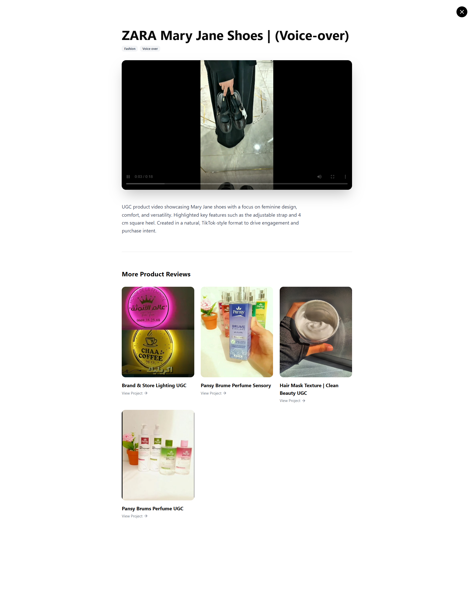
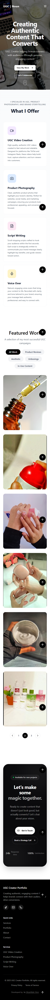

# UGC-Portfolio
# Portfolio Noran

A modern, responsive portfolio website built for a **UGC (User-Generated Content) Creator** to showcase projects, services, and brand collaborations.

The portfolio is designed to be **easy to manage**, **media-friendly**, and **production ready**, with content and assets handled through external services instead of hard-coded updates.

---

## Overview

Portfolio Noran is a React-based portfolio focused on visual content such as videos and images.  
It uses a lightweight CMS setup so the creator can manage projects and content without touching the codebase.

Media assets are hosted externally to ensure good performance and reliable delivery.

**Live Demo:** [[](https://nounranugc.netlify.app/)](#)

---

## Showcase

 |

 |

 |

 |

 |


## Features

- Fully responsive, mobile-first layout
- Clean and modern UI built with Tailwind CSS
- Smooth animations using Framer Motion
- Project and work showcase sections
- **Content management via Netlify CMS**
- **Authentication via Netlify Identity**
- **Media hosting and delivery using Cloudinary**
- Reusable UI components
- Fast development and optimized builds with Vite
- Deployed as a real, live portfolio

---

## Tech Stack

### Frontend
- React
- TypeScript
- Vite
- Tailwind CSS
- Framer Motion
- Radix UI
- Embla Carousel
- React Hook Form

### Content & Media
- **Netlify CMS** – content management
- **Netlify Identity** – CMS authentication
- **Cloudinary** – image & video hosting and optimization

### Deployment
- Netlify
- GitHub Pages

---

## Project Structure

```

portfolio-noran/
├── content/            # CMS-managed content (projects, services)
├── public/             # Static assets
├── src/
│   ├── app/
│   │   ├── components/ # Page sections (Hero, Portfolio, Services)
│   │   └── ui/         # Reusable UI components
│   ├── assets/         # Local assets (icons, placeholders)
│   ├── styles/         # Global styles and theme
│   └── main.tsx        # App entry point
├── index.html          # Netlify Identity integration
├── package.json
└── vite.config.ts

````

---

## Getting Started

### Requirements
- Node.js 18+
- npm or pnpm

### Install & Run
```bash
git clone https://github.com/himihiba/portfolio_noran.git
cd portfolio_noran
npm install
npm run dev
````

---

## Content Management

* Content is managed through **Netlify CMS**
* Login is handled via **Netlify Identity**
* Projects and services are stored in structured content files
* Images and videos are uploaded and delivered via **Cloudinary**

This setup allows non-technical updates while keeping the frontend fast and clean.

---

## Build & Deployment

### Build

```bash
npm run build
```

Output is generated in the `dist/` folder.

### Deploy

* **Netlify**

  * Build command: `npm run build`
  * Publish directory: `dist`
  * Identity enabled for CMS access

* **GitHub Pages**

```bash
npm run deploy
```

---

## 👤 Author

**HibatAllah Himi**
Front-End Developer
GitHub: [https://github.com/himihiba](https://github.com/himihiba)
